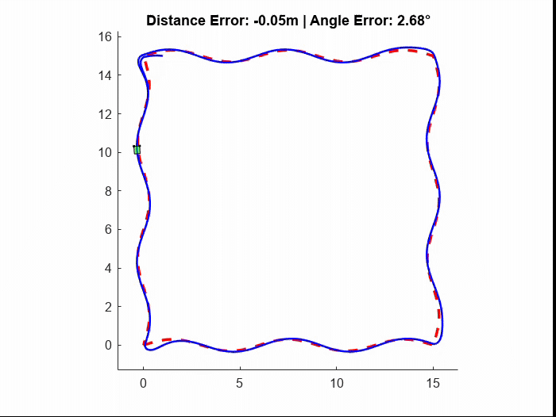

# 🚙 Robot Path Following Simulation (MATLAB)

This project simulates a differential drive robot following a sinusoidal-square path.
The robot uses distance and angle errors to track the path using a custom PID-like controller.
The animation of the robot movement and error plots are also generated.

---

## ⭐ Features

* Differential drive robot kinematic model
* Sinusoidal square path (4 sides with sinusoidal patterns)
* Real-time computation of distance and angle errors
* Custom PID-based control of wheel angular velocities
* Full simulation of robot trajectory
* Animated visualization of robot movement
* Error plotting for analysis

---


## 🎥 Simulation Demo



---

---

## 📁 Code Structure

### 1. **Robot Parameters**

Defines:

* Wheel radius
* Wheel separation
* Robot body dimensions

### 2. **Path Generation**

Creates a sinusoidal square path consisting of:

* Bottom side
* Right side
* Top side
* Left side

### 3. **Simulation Loop**

Each iteration:

* Find nearest point on the path
* Compute distance error
* Compute orientation error
* Apply controller
* Update robot state (x, y, θ)

### 4. **Animation**

Draws:

* Robot body
* Wheels
* Path
* Traveled trajectory
* Error information

### 5. **Functions**

* `calculate_errors()`
* `control_function()`
* `plot_errors()`

---

## 🧮 Robot Kinematics

```math
v = \frac{v_r + v_l}{2}
```

```math
\omega = \frac{v_r - v_l}{L}
```

```math
x_{t+1} = x_t + v \cos(\theta) \, dt
```

```math
y_{t+1} = y_t + v \sin(\theta) \, dt
```

```math
\theta_{t+1} = \theta_t + \omega \, dt
```

---

## 🎯 Control Algorithm

Main controller gains:

```matlab
kp = 0.4;   % Proportional gain for distance
ki = 0.1;   % Integral gain
kd = 100;   % Derivative-like gain for heading error
```

---

The controller:

* Computes linear velocity proportional to distance error
* Computes angular correction using heading error
* Limits maximum turning rate
* Includes special handling for sharp corners and transitions

---

## ▶️ How to Run

Simply run the main script in MATLAB:

```
matlabrobot_simulation.m
```

You will see:

* Live animated robot following the path
* Reference path (blue) vs actual trajectory (red)
* Real-time distance and angle error plots

---

## 📊 Outputs

✔ Trajectory comparison plot
✔ Live animation with robot body and wheels
✔ Distance error and heading error vs. time graphs

---

## 🛠 Requirements

* MATLAB R2018b or newer
* No extra toolboxes needed

---

## 📌 Notes & Tuning

* You can easily tune kp, ki, kd for better performance
* Change path amplitude, frequency, and resolution in the code
* Robot size only affects visualization, not dynamics

---

Enjoy the simulation! 🚙✨

---

## 👨‍💻 Author  
Model Developer: **[Mohammad Esteghamat]**  
Feel free to reach out if you're interested in collaboration, development, or research use.

---

## ⭐ If this project helped you…  
Consider starring the GitHub repository!


